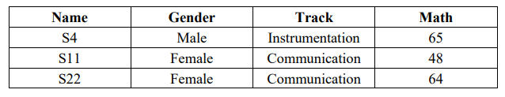

# PA4-MAPAYE
- __Download__ the _ECE Board Exam 2 dataset_ and write a Python script/code in the Jupyter Notebook to do the given problems.

## :ledger: Index

- [Description/Given Problems](#beginner-descriptiongiven-problems)
- [Getting Started](#green_circle-getting-started)
   - [Dependencies](#electric_plug-dependencies)
- a
- a
- a
- a
- aa
- a
- a
- a
- a
- a
- a
- a
- 

## :beginner: Description/Given Problems
__ECE BOARD EXAM PROBLEM:__ Using data wrangling and data visualization technique with storytelling, analyze the data and present different (i) data frames; and (ii) visuals using the dataset given.

1. Create the following data frames based on the format provided:
   - Example: Vis = [“Name”, “Gender”, “Track”, “Math<70”]; hometown is constant as __Visayas__
      
      
     Output:
      
     
      
      
     - a) Filename: Instru = [“Name”, “GEAS”, “Electronics >70”]; where track is constant as Instrumentation and hometown Luzon
     - b) Filename: Mindy = [ “Name”, “Track”, “Electronics”, “Average >=55”]; where hometown is constant as Mindanao and gender Female
       
2. Create a visualization that shows how the different features contributes to average grade. Does chosen track in college, gender, or hometown contributes to a higher average score?

## :green_circle: Getting Started

### :electric_plug: Dependencies
* Anaconda Navigator
* Jupyter Notebook
* _**[board2.xlsx](board2.xlsx)**_
* _Optional: Microsoft Excel_
* Any updated version of Windows, Mac, or Linux that is capable of running the programs above.
     

